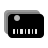

# My Loyalty Cards



A lightweight, privacy-first PWA for storing and displaying your loyalty cards — no account, no server, no tracking.

Your cards live entirely in the URL. Add a card, copy the link, bookmark it or save it to your home screen. That's it.

## Features

- **URL-based storage** — cards are encoded in the query string; nothing is stored server-side
- **Share via link** — copy the URL and send it to yourself or anyone else
- **Barcode rendering** — supports Code 128, QR Code, and EAN-13 per card
- **Full-screen barcode** — tap any barcode to open it full-screen for scanning at the till
- **Offline support** — works without a connection once loaded (PWA service worker)
- **Add to Home Screen** — installable on iOS and Android for quick access

## Supported Stores

| Code | Store |
|------|-------|
| `xts` | Checkers Xtra Savings |
| `pnp` | Pick n Pay Smart Shopper |
| `wlw` | Woolworths MyDifference |
| `cls` | Clicks ClubCard |
| `dch` | Dis-Chem Better Rewards |
| `spr` | SPAR Rewards |
| `okf` | OK Count On |
| `mak` | Makro mCard |
| `gme` | Game more rewards |
| `mrp` | Mr Price Reward |
| `smw` | Sportsman's Warehouse |
| `tsp` | TOPS at SPAR |
| `med` | MediRite |
| `cna` | CNA |
| `flm` | Food Lover's Market |
| `spu` | Spur Family Card |
| `dis` | Discovery Vitality |
| `fnb` | FNB eBucks |
| `cap` | Capitec Live Better |
| `tfg` | TFG Rewards |
| `mtn` | MTN mpulse |
| `eng` | Engen |
| `lka` | Lekka |
| `bld` | Builders Warehouse |
| `pkr` | Parkrun |
| `clc` | Cell C |
| `tru` | Toys R Us |
| `skr` | Ster Kinekor |

## URL Format

```
/?cards=cks:ABC123:code128,pnp:XYZ789:qr
```

Each card is encoded as `company:cardNumber:barcodeType`, comma-separated.

## Tech Stack

- [Next.js 16](https://nextjs.org) + React 19
- [Tailwind CSS v4](https://tailwindcss.com) + [daisyUI 5](https://daisyui.com)
- [bwip-js](https://github.com/metafloor/bwip-js) for barcode rendering
- [@ducanh2912/next-pwa](https://github.com/DuCanhGH/next-pwa) for PWA support

## Development

```bash
bun dev
```

Open [http://localhost:3000](http://localhost:3000).

## Build

```bash
bun run build --webpack
bun start
```
